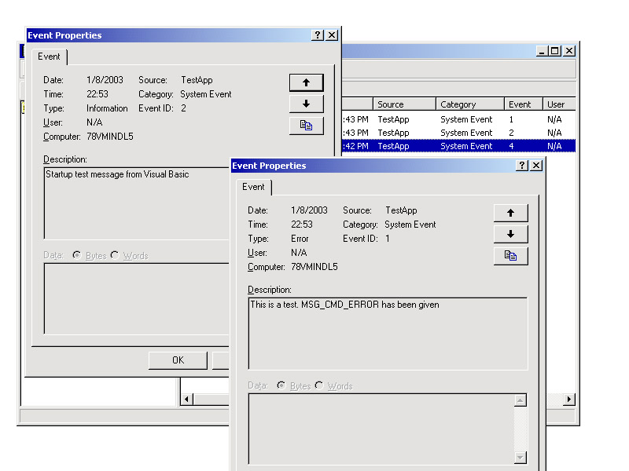



## Write To The NT/2K Event Logs Like the Pros Do\!

### Description

Important to know here: This is not of the faint of heart here. This delves deep into one of the more obscure Windows architecture topics: The Eventlog Service, and logging events to event logs. Also tackles topics such as editing the registry and compiling special DLLs from the command line. Special thanks to Don Kiser for his wonderful registry manipulation class. Without it, some of this would have been a lot harder. Please vote for this, and if you have any problems, drop me a line or reply to the posting here. Good luck!
 
### More Info
 

             |
---                |---
**Submitted On**   |2003-01-08 23:11:30
**By**             |[Devin Watson](https://github.com/Planet-Source-Code/PSCIndex/blob/master/ByAuthor/devin-watson.md)
**Level**          |Advanced
**User Rating**    |5.0 (15 globes from 3 users)
**Compatibility**  |VB 6\.0
**Category**       |[Windows API Call/ Explanation](https://github.com/Planet-Source-Code/PSCIndex/blob/master/ByCategory/windows-api-call-explanation__1-39.md)
**World**          |[Visual Basic](https://github.com/Planet-Source-Code/PSCIndex/blob/master/ByWorld/visual-basic.md)
**Archive File**   |[Write\_To\_T152618182003\.zip](https://github.com/Planet-Source-Code/devin-watson-write-to-the-nt-2k-event-logs-like-the-pros-do__1-42284/archive/master.zip)

